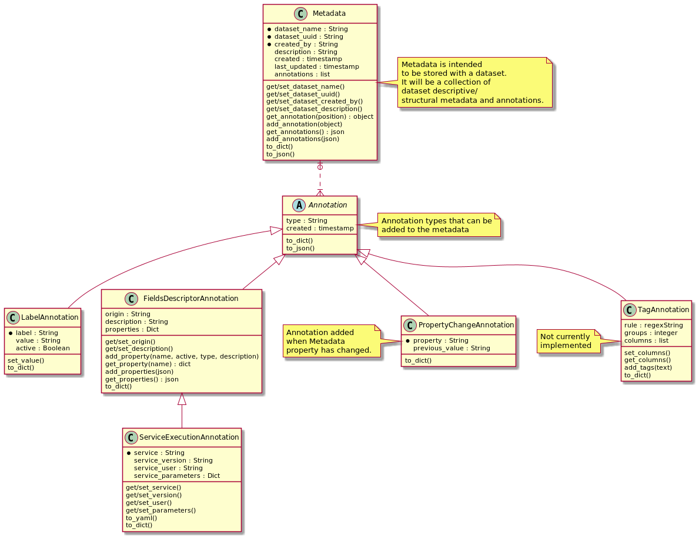

Informatics Matters Data-Manager Metadata
=========================================

A metadata framework package for the Data Tier Data Manager service.
The ``im-data-manager-metadata`` package is a set of utilities
employed by the `Informatics Matters`_ Data-Manager service
as a metadata framework for molecular datasets.

Dependencies
************
- PyYAML>=5.3
- jsonpickle>=2.0.0

Running the Unit Tests
**********************

    >>> python -m venv ~/.venv/data-manager-metadata
    >>> source ~/.venv/data-manager-metadata/bin/activate
    >>> pip install --upgrade pip
    >>> pip install -r package-requirements.txt
    >>> python -m unittest test.test

Running the Command Line Interface *md-manage.py*
*************************************************

The data manager metadata command line interface can be used by applications to
add annotations to the Metadata by means of an annotations.json files that can be
uploaded.

    - help functions. Note that the *annotation_type* (lb, fd or se) is required.

    >>> python md_manage.py -h
    >>> python md_manage.py lb -h
    >>> python md_manage.py fd -h
    >>> python md_manage.py se -h

    - Creates a label annotation in an annotations.json file placed in test/output.
      Note that the *label* is required. Running the command again will create a second annotation
      in the same file (i.e. a list of two).

    >>> python md_manage.py lb test/output/results.sdf 'foo' -lv='bar'

    - Creates a FieldsDescriptorAnnotation in an annotations.json file placed in test/output.
      If the annotations.json file exists it will add it to the list of annotations in the file.

    >>> python md_manage.py fd test/output/results.sdf -fo='squonk2-job'
                            -fp='minimizedAffinity,number,Binding affinity
                            predicted by smina using the vinardo scoring function,true,true'
                            -fd='Run smina docking'

    - Creates a service execution annotation in an annotations.json file placed in test/output.

    >>> python md_manage.py se test/output/results.sdf -su=bob -sys='run-smina'
                           -sy='test/input/virtual-screening.yaml'
                           -sp param1=val1 param2=val2 -fo='squonk2-job'
                           -fp='minimizedAffinity,number,Binding affinity predicted,true,true'
                           -fd='Run smina docking'

.. _Informatics Matters: http://www.informaticsmatters.com
