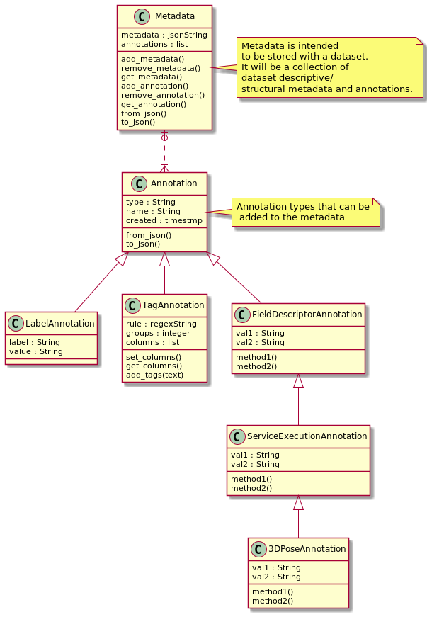

Informatics Matters Data-Manager Metadata
=========================================

A metadata package for the Data Tier Data Manager service.
The ``im-data-manager-metadata`` package is a set of utilities
employed by the `Informatics Matters`_ Data-Manager service
as a metadata framework for molecular datasets.

Dependencies
************
- PyYAML>=5.3
- jsonpickle>=1.4.2

Running the Unit Tests
**********************

    >>> python -m unittest test.test

Example usage::
***************

See test/test.py

    >>> from data_manager_metadata import metadata
    >>> m_version: str = metadata.version()

.. _Informatics Matters: http://www.informaticsmatters.com
